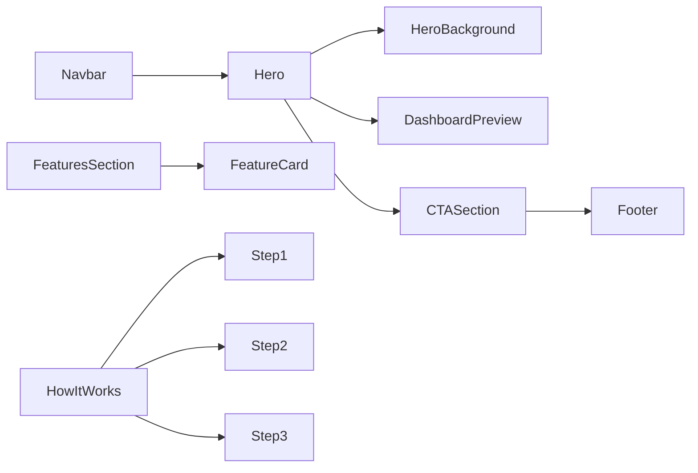
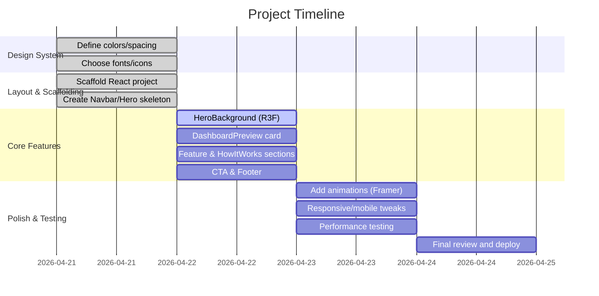

# Executive Summary  
This report outlines a full plan to build a **premium, futuristic homepage** for a subscription-management app using React, Tailwind CSS, Framer Motion, and React Three Fiber (R3F). The goal is to deliver a polished, startup-quality landing page that impresses in a 60–120 second hackathon demo on a laptop. We adopt a dark theme with glassmorphism and motion to create a modern, high-end feel, while following UX best practices for clarity, spacing and performance. The project is broken into clear phases: design system, layout scaffolding, 3D background, dashboard preview, feature sections, final CTAs, and polish. Antigravity’s agent-driven workflow is leveraged step-by-step: we start with a high-level layout prompt, then iteratively refine each section (Hero, Features, etc.), add Three.js effects, and finally animations. Tables of components, timeline, and risks guide the build. Key principles and citations from official sources (Antigravity docs, Tailwind docs, R3F docs, design guides) ensure an informed design. 

## Project Goals & Demo Constraints  
- **Core Product:** A subscription tracker app. Users can add subscriptions (Netflix, Spotify, etc.) with cost and billing dates, see total monthly spend, upcoming payments, and get alerts or savings tips.  
- **Hackathon Context:** Limited time to implement; demo on a developer laptop. The UI must **look complete and impressive in ~90s** (target 60–120s). Judges expect a running application, so include a **realistic mock dashboard preview** on the homepage.  
- **Demo Flow:** Show the homepage (hero + stats), quickly add a few subscriptions, then show analytics (total spend, charts, due reminders). Emphasize unique features (e.g. “AI advisor: Cancel unused subs to save ₹500”). End on a strong call-to-action to sign up. Keep steps concise and visual.  

## UX & Design Principles  
- **Dark Theme:** Modern “tech” aesthetic and reduced glare in low light. A well-designed dark mode can **reduce eye strain** for many users in dark environments【44†L108-L113】. However, ensure high contrast text (avoid pure black backgrounds; use dark navy or slate grays) to meet accessibility. For example, use backgrounds like `#0F172A` (slate-900) and cards `#1E293B` (slate-800). Always test contrast with WCAG guidelines (e.g. [44] emphasizes contrast in dark mode).  
- **Glassmorphism:** Use semi-transparent, blurred panels to create depth. Glassmorphic elements (backdrop-blur with 10–30% tint) give a clean, futuristic vibe【46†L15-L23】【46†L118-L122】. Example: frosted glass cards for stats or feature boxes. Key tips: balance blur vs opacity so text remains readable (add a subtle dark overlay behind white text【46†L118-L122】). Layer blurred cards over abstract background shapes to make them “pop” (the blurred background should have some shape or gradient to produce the frosted effect【46†L29-L32】【46†L118-L122】).  
- **Minimal, Spaced Layout:** Use plenty of padding and whitespace to make sections breath and focus attention. Tailwind’s spacing scale is 4px-based (1 = 0.25rem = 4px by default)【30†L310-L314】. A base unit of 8px or 16px is common. For example, apply `p-6` (24px) or `p-8` (32px) on major cards, and use `gap-8` (32px) between cards. Consistent spacing (e.g. 16/24/32px) and a simple grid keep the design clean.  
- **Typography:** Choose modern sans-serifs (e.g. **Inter** or **Poppins** from Google Fonts). Use large, bold headings (24–36px or more for desktop) and comfortable body text (16px+). Maintain a clear visual hierarchy. Ensure letter-spacing/line-height for readability in dark mode.  
- **Micro-interactions:** Subtle motion adds polish without distraction. Use smooth transitions (e.g. **Framer Motion** fade/slide for sections), hover animations on cards/buttons (slight scale or elevation). Animation durations ~200–300ms with ease-out feel responsive. Do NOT over-animate text blocks or critical UI. Per [Antigravity best practices], iterative refinement means add effects last【27†L471-L475】.  

## Design System  
Define exact tokens and styles up front for consistency:  
- **Color Palette:** 
  - Primary background: `#0F172A` (dark navy).  
  - Card/bg panels: `#1E293B` (dark slate).  
  - Accent colors (from Tailwind defaults): **Blue-500** `#3B82F6` (“professional, trustworthy” blue【36†L25-L32】) for primary buttons/links, **Green-500** `#22C55E` (“vibrant, successful” green【34†L25-L30】) for positive highlights or success states, **Purple-600** `#A855F7` for secondary highlights.  
  - Text colors: Light text `#E2E8F0` (gray-300) on dark backgrounds, white for highest emphasis. Use `text-gray-100` (#F8FAFC) for large dark-text-on-light elements.  
- **Spacing Scale:** Tailwind’s default (0,1,2,...,96 in units of 0.25rem) is fine【30†L310-L314】. We follow an 8px base (`p-2 = 8px, p-4 = 16px, p-6 = 24px, p-8 = 32px`, etc). Use multiples (16px/24px/32px etc) for margins, padding, gaps. For example: 
  - Container padding: `px-8 py-16` on hero section.  
  - Grid gap: `gap-8` (32px) between feature cards.  
- **Typography:** Example font-family stack: `font-family: 'Inter', sans-serif;` for body, and maybe `'Poppins', sans-serif` for headings. Use `text-4xl` for hero headline, `text-xl` or `text-lg` for subheads.  
- **Elevation & Shadows:** Use soft shadows for floating effect. E.g. `shadow-xl` on hero text panel or dashboard card. Keep shadows subtle (no harsh blacks). We can generate shadows via TW config or use defaults.  
- **Animation Timing:** Short transitions (<300ms). Fade-in or slide-up for sections on mount (enter viewport). Example: `transition duration-200 ease-out`. Framer Motion props can be `{ duration: 0.2 }`.  

## Component List & Responsibilities  

| Component         | Purpose                                                | Key Props / Details                                   |
|-------------------|--------------------------------------------------------|-------------------------------------------------------|
| **Navbar**        | Top navigation bar (logo, links, login/signup button). Sticky on scroll. | Contains logo (click home), nav links (features, etc.), and a prominent “Get Started” CTA. Use backdrop-blur on scroll for glass effect. Responsive (hamburger on mobile). |
| **Hero**          | Full-page intro section with headline, subtext, and CTAs.        | Props: `heading`, `subheading`, `primaryCTAText`, `secondaryCTAText`.  Left-aligned or centered text. Contains the **HeroBackground** (3D canvas) behind or to one side. |
| **HeroBackground**| Animated 3D scene behind Hero.                            | Implements `Canvas` (React Three Fiber) with subtle particles or geometry (e.g. floating dots or waves). Props: none. Should render behind hero content. Use `frameloop="demand"` for performance【13†L35-L38】. Limit to a few hundred meshes (≤1000)【13†L148-L152】. |
| **DashboardPreview** | Mock dashboard UI panel in Hero (or separate section). Shows spend totals and charts. | Props: e.g. `data` for mock statistics. Renders total spend, number of subs, and a mini-chart (e.g. Line or Bar). List of example subscriptions (icon, name, price, next due, status). Use card UI with rounded corners and subtle shadow (`bg-slate-800`, `p-6`). This sells “real working app”. |
| **FeatureCard**   | A single feature/benefit item.                         | Props: `icon`, `title`, `description`. Use glass panel style: `bg-white bg-opacity-10 backdrop-blur-sm`, padding and rounded corners. Animate on hover (Framer: `whileHover={{ scale: 1.05 }}`). E.g.: Icon at top, bold title, short text. |
| **HowItWorks**    | Illustrates 3 steps (e.g. Add → Track → Save).          | Likely a horizontal list of steps with icons/arrows. Props: none or step data. Use e.g. Step 1: Add subscriptions; Step 2: Track billing; Step 3: Save money. Each step has an icon (shopping cart, chart, piggy-bank), a short title and caption. On mobile, stack vertically. |
| **CTASection**    | Final call-to-action.                                  | Contains a strong closing pitch (e.g. “Ready to take control of your subscriptions?”) and a big button. Props: `text`, `buttonText`. Full-width, high-contrast button (`bg-blue-500 text-white`). Possibly repeated or fixed in Navbar and Hero too. |
| **Footer**        | Bottom information bar.                                | Minimal links (Contact, Privacy, etc.), small text. Dark background, small text-white. Blurred backdrop if over background. |

Each component lives in `src/components/`. We use **reusable patterns**: FeatureCard is mapped over an array of features; Hero accepts dynamic text as props; DashboardPreview receives a prop or uses hardcoded mock data in the component.

## File/Folder Structure  
A clean React project layout might be:  
```
src/
├── components/
│   ├── Navbar.jsx
│   ├── Hero.jsx
│   ├── HeroBackground.jsx
│   ├── DashboardPreview.jsx
│   ├── FeatureCard.jsx
│   ├── HowItWorks.jsx
│   ├── CTASection.jsx
│   └── Footer.jsx
├── App.jsx
├── index.jsx
└── tailwind.config.js
```
- `App.jsx` stitches sections together in order (Navbar, Hero, Features, HowItWorks, CTA, Footer).  
- Use a single CSS entry (import Tailwind base in `index.css`).  
- We might use **React Router** if multiple pages, but for a single-page landing it’s unnecessary.  

## Antigravity Prompt Strategy  
We use an **iterative, multi-step prompting** approach【27†L471-L475】: start broad, then refine.  
- **Step 1:** *Project Setup & Layout.* Prompt Antigravity to **initialize** a React+Tailwind project and output a scaffold of components. For example:  
  ```
  Prompt: "Create a new React app. Install Tailwind CSS. Set up file structure: Navbar, Hero, Features, HowItWorks, CTA, Footer components. Use semantic JSX sections with placeholder content and Tailwind class names for layout (flex, grid, spacing)."
  ```  
- **Step 2:** *Navbar & Hero (static).* Prompt to flesh out the **Navbar** and **Hero** sections (headings, subtext, CTAs) with correct Tailwind classes for spacing and typography. Ensure Hero has a container for the 3D canvas.  
- **Step 3:** *HeroBackground 3D.* Prompt for the **HeroBackground** component specifically: e.g. “Using React Three Fiber, create a `HeroBackground` component with animated particles or a subtle wave pattern. Use a Canvas that auto-resizes, add ambient light, and gently moving points or a noise geometry. Keep particles low-poly (<500 spheres).”  
- **Step 4:** *DashboardPreview mock data.* Prompt to create **DashboardPreview** content: “Generate a card showing total monthly spend (e.g. ₹2,499), number of active subscriptions, and a mini line chart. Include list items for example subs (Netflix ₹499, Spotify ₹129, etc.) with due dates and status badges.”  
- **Step 5:** *Features and HowItWorks.* Prompt for **FeatureCard** components: “Add a features section with 3-4 cards. Each card: an icon (e.g. chart, bell, piggy-bank), a short title (“Analyze Spending”, “Due-Date Alerts”, etc.) and a line of descriptive text. Use flex/grid layout.” For HowItWorks: “Add a 3-step horizontal list: Step 1: Add Subscriptions, Step 2: Track Renewals, Step 3: Save Money.”  
- **Step 6:** *CTA and Footer.* Prompt to add a final CTA section: “Add a dark full-width section with big text and a single call-to-action button (‘Get Started Free’).” Add Footer: “Add a minimal footer with centered small text.”  
- **Step 7:** *Animations & Polish.* Prompt to apply Framer Motion: “Animate each section on mount (fade in, slide up). Add hover effect to cards/buttons. Ensure smooth transitions (200ms).”  
- **Step 8:** *Review & Refine.* Prompt agent to **review code** and fix spacing issues or responsiveness: “Check mobile layout: Hero stacks vertically, menu collapses, feature cards wrap. Optimize any performance issues.”  
- **Example Prompts:**  
  - *Initial Layout Prompt:* `"Generate the base JSX layout for a subscription tracker homepage with sections: Navbar, Hero, Features, HowItWorks, CTA, Footer. Use React functional components and Tailwind CSS utility classes for spacing and colors."`  
  - *3D Background Prompt:* `"In HeroBackground.jsx, use React Three Fiber to add a Canvas with floating particles. Use useFrame to animate slight rotation or movement. Keep mesh count low. Example: create 300 small sphere meshes with random positions."`  
  - *Feature Card Prompt:* `"Make a reusable <FeatureCard> component: it takes icon, title, text. It should render a glass-like card with backdrop-blur, padding and rounded corners. Add a hover scale animation with Framer Motion."`  
*(All prompts should be clear, stepwise, and use planning mode【27†L471-L475】.)*

## Sample Code Snippets  

**HeroBackground (R3F particles):**  
```jsx
import { Canvas, useFrame } from '@react-three/fiber';
import { Points, PointMaterial } from '@react-three/drei';
import * as THREE from 'three';

function Particles() {
  const ref = useRef();
  // Create geometry with many points
  const particles = useMemo(() => {
    const geom = new THREE.BufferGeometry();
    const count = 500;
    const positions = new Float32Array(count * 3);
    for (let i = 0; i < count; i++) {
      positions[i*3]   = (Math.random() - 0.5) * 10;
      positions[i*3+1] = (Math.random() - 0.5) * 10;
      positions[i*3+2] = (Math.random() - 0.5) * 10;
    }
    geom.setAttribute('position', new THREE.BufferAttribute(positions, 3));
    return geom;
  }, []);
  // Animate rotation
  useFrame((state) => {
    ref.current.rotation.y += 0.0005;
  });
  return (
    <points ref={ref} geometry={particles}>
      <PointMaterial 
        color="#3B82F6" 
        size={0.05} 
        sizeAttenuation={true} 
        transparent 
      />
    </points>
  );
}

export default function HeroBackground() {
  return (
    <Canvas frameloop="demand" camera={{ position: [0, 0, 5] }}>
      <ambientLight intensity={0.5} />
      <Particles />
    </Canvas>
  );
}
```
This creates ~500 particles with gentle movement. We use `frameloop="demand"` to pause when idle【13†L35-L38】 and keep draw calls low (500 < 1000)【13†L148-L152】.

**DashboardPreview (mock data):**  
```jsx
export default function DashboardPreview() {
  return (
    <div className="bg-slate-800 p-6 rounded-xl shadow-lg w-full max-w-md">
      <div className="flex justify-between items-center text-gray-200">
        <h3 className="text-sm">Total This Month</h3>
        <span className="text-2xl font-bold">₹2,499</span>
      </div>
      {/* Placeholder for a chart */}
      <div className="mt-4 h-24 bg-gradient-to-r from-blue-500 to-green-500 rounded"></div>
      <ul className="mt-4 space-y-2 text-gray-300">
        <li className="flex justify-between">
          <span>Netflix</span><span>₹499/mo</span>
        </li>
        <li className="flex justify-between">
          <span>Spotify</span><span>₹129/mo</span>
        </li>
        <li className="flex justify-between">
          <span>YouTube Premium</span><span>₹299/mo</span>
        </li>
      </ul>
    </div>
  );
}
```
This component uses Tailwind to layout spend stats and a simple gradient bar as a chart placeholder. In real code, you’d use a chart library.

**FeatureCard (with hover animation):**  
```jsx
import { motion } from 'framer-motion';

export default function FeatureCard({ icon, title, description }) {
  return (
    <motion.div 
      whileHover={{ scale: 1.05 }} 
      className="bg-white bg-opacity-10 backdrop-blur-sm p-6 rounded-lg shadow-md"
    >
      <div className="text-3xl text-blue-400">{icon}</div>
      <h4 className="mt-4 text-xl font-semibold text-white">{title}</h4>
      <p className="mt-2 text-gray-200">{description}</p>
    </motion.div>
  );
}
```
Each card glows on hover. Example usage: `<FeatureCard icon="💡" title="Smart Alerts" description="Receive reminders before renewals." />`.

## Component Relationships (Mermaid)  

This diagram shows the component hierarchy: the `App` renders `Navbar`, `Hero`, `FeaturesSection`, `HowItWorks`, `CTASection`, and `Footer`. The `Hero` includes both the 3D `HeroBackground` and the `DashboardPreview` sub-component.

## Build Workflow (Mermaid Gantt)  

*Estimated timeline to build and polish each section. In practice, many steps run in parallel.*

## Performance Rules & Testing Checklist  
- **Maintain ≥30–60 FPS:** Test the 3D scene on a typical laptop. Ensure the canvas is paused or minimal on mobile (`frameloop="demand"`【13†L35-L38】). Keep meshes well below 1000【13†L148-L152】.  
- **On-demand Rendering:** Use `frameloop="demand"` so the 3D scene renders only when needed (e.g. mouse movement)【13†L35-L38】. For static animations, use Framer Motion which doesn’t force constant 60fps.  
- **Lazy-load Non-critical Elements:** If needed, load the 3D background **after** the main UI (e.g. using React’s `<Suspense>` or dynamic import). The page should still be usable if the 3D scene lags.  
- **Bundle Size:** Only include essential libraries. (Three.js and R3F add overhead; consider a lighter particle system if available.) Use production build and check bundle size.  
- **Mobile Fallback:** On small screens, disable or simplify 3D effects (e.g. render a static gradient instead). Ensure the layout stacks correctly.  
- **Accessibility:** Verify text contrast (tools like Tailwind’s color contrast checker or WCAG reference【40†L268-L274】). Provide `alt` text for any icons/images. Ensure keyboard focus states on buttons.  
- **Responsiveness:** Check on different breakpoints. Navigation should collapse to a hamburger on narrow widths, and columns should stack.  

## Integration & Deployment Steps  
1. **Local Setup:** Install Node.js (v16+). In a terminal:  
   ```
   npx create-react-app subscription-tracker
   cd subscription-tracker
   npm install -D tailwindcss postcss autoprefixer
   npx tailwindcss init
   ```  
   Configure `tailwind.config.js` with content paths. In `index.css`, import Tailwind base, components, utilities. (Tailwind works by scanning your JSX for class names【40†L268-L274】.)  
2. **Install Libraries:**  
   ```bash
   npm install @react-three/fiber @react-three/drei framer-motion
   ```  
3. **Development:** Run `npm start`. The React dev server opens at `localhost:3000`. Code components under `src/`.  
4. **Version Control:** Commit often. Use a Git repo (GitHub) to track changes. This also helps if Antigravity makes mistakes – you can revert easily.  
5. **Build:** Once ready, run `npm run build` to create a production bundle.  
6. **Hosting:** Deploy the `build/` output. For a quick demo, use a service like **Vercel** or **Netlify** (both support React apps with zero-config). Alternatively, use `serve` (`npm install -g serve; serve -s build`).  
7. **Antigravity Tips:** Use **Workflows** or **Tasks** in Antigravity to automate repetitive actions (e.g. eslint fixes, git commit)【27†L471-L475】. Define any project-specific rules (e.g. “always use dark theme” in an `AGENTS.md` file if needed).  

## Demo Script & Timing (0–120s)  
- **0–10s:** Show the **Navbar** (logo on left, “Get Started” button on right) and **Hero**. Read the headline (“Track every subscription before it drains your wallet.”) and subtext. Click a “Login” or “Get Started” button to simulate entering.  
- **10–30s:** On the dashboard preview panel, click “Add Subscription” twice: first Netflix (₹499/mo), then Spotify (₹129/mo). The preview panel should update (manually or via state) showing the new totals (e.g. “₹628 total”).  
- **30–50s:** Switch view to a **Dashboard** tab (if multi-tab) or scroll. Show the **total monthly spend** and a mini-chart trending up. Highlight an upcoming renewal listed (with “Due soon” badge in red).  
- **50–70s:** Show the **Features** section: point out one card (“Spend Analytics”) and hover to enlarge it. Then click “How It Works” to reveal the 3-step graphic.  
- **70–90s:** Demonstrate a “smart suggestion”: for example, if two similar subscriptions exist, highlight a “Cancel duplicate” recommendation.  
- **90–110s:** Scroll or navigate to the final CTA section. Read the closing pitch (“Ready to save money? Start managing your subs now.”) and click the final “Get Started – It’s Free” button.  
- **110–120s:** End with a quick screen of the app, summarizing its benefits. Thank the judges.  

Keep each step crisp. Use the UI as your script: the graphics and text should **speak for themselves**. Practice transitions to ensure smooth timing.

## Risk & Mitigation  

| Risk                                        | Mitigation                                                                                      |
|---------------------------------------------|-------------------------------------------------------------------------------------------------|
| **3D background causes lag**                | Use minimal objects (<=500 particles), enable `frameloop="demand"`【13†L35-L38】, test FPS. Provide a non-3D fallback (e.g. static image) on performance fail. |
| **Low text contrast in dark mode**          | Follow WCAG contrast; use tinted overlays on blurred cards【46†L118-L122】. Test with accessibility tools. |
| **Agent stops or generates errors**         | Use Antigravity’s **Planning mode** (guide agent with step-by-step prompts)【27†L471-L475】. Check code between steps. Keep prompts clear and specific. |
| **UI inconsistency**                        | Lock down design tokens (colors, spacing) in `tailwind.config.js`. Refactor via 21st.dev or similar tools if needed for consistency. |
| **Feature creep / time running out**        | Prioritise core features (as listed). If short on time, simplify: skip extra charts or secondary pages and focus on hero + demo flow. |
| **Poor mobile layout**                      | Design mobile layout in parallel. Use Tailwind responsive classes (`md:`, `lg:`). If needed, hide animations on small screens. |

Each mitigation above should be considered during development and testing. For example, after implementing the 3D hero, check performance on a typical laptop (Nvidia GPU) and on a mid-range laptop/phone. Adjust the scene accordingly【13†L148-L152】.

**Citations:** Authoritative sources guided this plan: Google Antigravity docs (agent-first workflow, iterative prompts)【1†L37-L43】【27†L471-L475】, Tailwind CSS docs (spacing, color)【30†L310-L314】【36†L25-L32】【34†L25-L30】, React Three Fiber performance guide【13†L35-L38】【13†L148-L152】, and design articles on dark mode【44†L108-L113】 and glassmorphism【46†L15-L23】【46†L118-L122】. These confirm the techniques and constraints we use.

